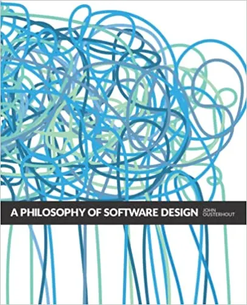

# 📖 Actionable Philosophy Book Club

A low-friction repository for the **Actionable Philosophy Book Club**, focusing on software design philosophy and AI-assisted engineering.

---

  

---

## 🚀 Interactive Dashboard
For the best experience, including mobile-optimized navigation, meeting agendas, and instant slide previews, visit our dashboard:

**[View the High-Fidelity Dashboard &rarr;](https://mhenke.github.io/actionable-philosophy-book-club/)**

---

## 📂 Repository at a Glance

*   **[`meetings/`](meetings/)**: Historical notes, slides, and recordings for every session.
*   **[`docs/`](docs/)**: Design principles, glossary, and architectural decisions.
*   **[`templates/`](templates/)**: Scaffolding for new meetings and AI prompt templates.
*   **[`asset-compressor/`](asset-compressor/)**: Custom AI tool for optimizing repository media.

## 🤖 AI-Assisted Workflows
We leverage AI to sharpen our craft. Use our [Prompt Templates](templates/prompts/) to extract insights or the [Compression Skill](asset-compressor/) to manage large assets.

## 🛠 Contributing
We value **content over ceremony**. See [CONTRIBUTING.md](CONTRIBUTING.md) for details on uploading materials and staying under the 50MB file limit.
